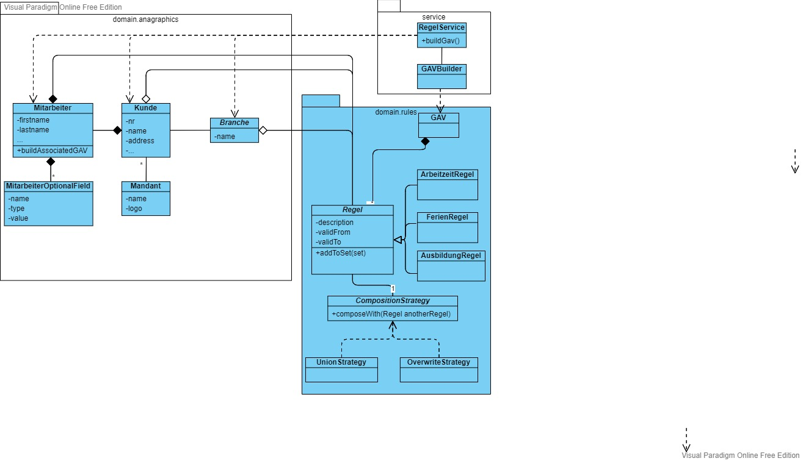

#### K8s

#### H2 Console
- AppStarten
- Url in Browser eingeben:
http://localhost:8080/h2-console/
- JDBC URL eingeben, z.B.:
jdbc:h2:C:/Projects/eGroup/gav/data/demo

#### Security
Die Rest Methoden sind nur für die Rolle 'USER' zugreifbar

#### curl
- DOS Prompt
curl -i -X POST -H "Content-Type: application/hal+json" -d "{\"firstName\" : \"John\", \"lastName\" : \"Doe\"}" http://localhost:8080/people

curl -i -X POST -H "Content-Type: application/hal+json"  --user spring:secret  -d "{\"firstName\" : \"John\", \"lastName\" : \"Doe\"}" http://localhost:8080/people
#### start
java -jar .\target\gav-poc-0.0.1-SNAPSHOT.jar
#### UML Class Diagram

